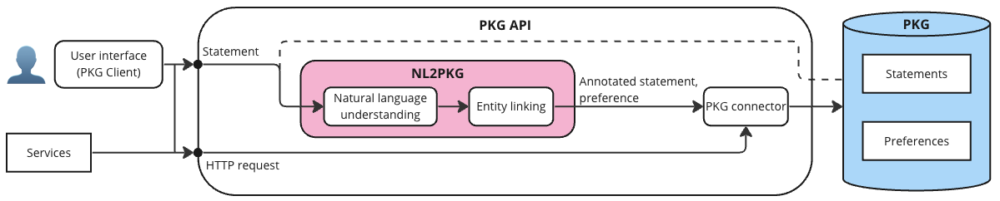

# PKG API: A Tool for Personal Knowledge Graph Management

[](https://github.com/psf/black)


The PKG API is a tool for managing personal knowledge graphs (PKGs). It provides a simple solution for end users and service providers to administrate and interact with the users' PKGs through natural language statements and simple web forms.
The representation of a statement inside the PKG is defined by the [PKG vocabulary](http://w3id.org/pkg/).
Within the API, two key modules are present: one for processing natural language statements ([NL2PKG](#nl2pkg)), and another for generating and executing SPARQL queries against the PKG ([PKG connector](#pkg-connector)).

The PKG API is served as a RESTful API and we provide a user interface, PKG Client, that allows users to manage their PKG online.



## PKG API

### NL2PKG

This module is responsible for processing natural language statements. The processing is divided into two steps: (1) natural language understanding handled by [`annotators`](pkg_api/nl_to_pkg/annotators) and (2) [`entity_linking`](pkg_api/nl_to_pkg/entity_linking).

Available annotators and entity linkers:

  * [`StatementAnnotator`](pkg_api/nl_to_pkg/annotators/annotator.py)
    - [`ThreeStepStatementAnnotator`](pkg_api/nl_to_pkg/annotators/three_step_annotator.py): Annotates statements using a three-step approach: (1) intent recognition, (2) Subject-Predicate-Object triple extraction, and (3) preference extraction.
  * [`EntityLinker`](pkg_api/nl_to_pkg/entity_linking/entity_linker.py)
    - [`RELEntityLinker`](pkg_api/nl_to_pkg/entity_linking/rel_entity_linking.py): Links entities using [Radboud Entity Linker](https://rel.readthedocs.io/en/latest/) API.
    - [`SpotlightEntityLinker`](pkg_api/nl_to_pkg/entity_linking/spotlight_entity_linker.py): Links entities using DBpedia Spotlight.

### PKG connector

The PKG connector is responsible for executing SPARQL queries against the PKG.
[Utilities functions](pkg_api/utils.py) are responsible for generating SPARQL queries based on the intent of the user. For example, if a user wants to add a statement to the PKG, a tailored INSERT query is generated.

### Server

The backend server is a [Flask](https://flask.palletsprojects.com/en/3.0.x/) server. It is responsible for connecting the users and service providers to PKGs.

#### Starting the server

Before starting the server, make sure that the [requirements](requirements.txt) are installed and that CORS is disabled in your web browser.

To start the server, run the following command:

```bash
flask --app pkg_api/server run --debug
```

Note the `--debug` flag is optional, but it is recommended to use it during development.

By default, the server will run locally on port 5000. In case you want to run the server on a different port, you can specify the port using the `--port` flag.

## PKG Client

The user interface is a React application that communicates with the server to manage the PKG. More details on how to run PKG Client can be found [here](pkg-client/README.md).

:warning: Note that you need to update `PKG_API_BASE_URL` in the [configuration](pkg_client/public/config.json) in case the server is not running on the default port.

## Demo

<https://github.com/iai-group/pkg-api/assets/28621493/cf51ab83-b7c9-4441-93c9-abd2bae18a98>

Instructions on how to run the demo can be found [here](docs/HOWTO_demo.md).

## Conventions

We follow the [IAI Python Style Guide](https://github.com/iai-group/styleguide/tree/main/python).

## Contributors

PKG API is developed and maintained by the [IAI group](https://iai.group/) at the University of Stavanger.
